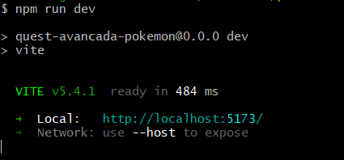

# PokemonList

Projeto do curso Dev Quest que tem por propósito criar uma wikipédia de pokemons através de requisições a pokeapi(https://pokeapi.co/). O objetivo é exibir as informações obtidas em tela. O projeto conta com uma página inicial e uma página interna com informações detalhadas.


## Funcionalidades

A aplicação oferece um layout responsivo, com opção entre tema light e dark, com tratamento de exceções para que caso ocorra falha na requisição, seja solicitado que o usuário atualize a página.


## Ferramentas utilizadas

- HTML
- JavaScript
- React JS
- React Router
- API rest
- Context API
- Styled-components


## Decisões adotadas

Foi solicitado que ao  clicar no botão avançar, o projeto carregasse mais 10 cards abaixo da listagem atual. Contudo, por motivos estéticos, decidi manter 10 cards na tela alternando apenas as informações sem gerar uma rolagem.

## Pré-requisitos para executar o projeto

- Node JS(v20.15.0)

## Como executar o projeto
Na sua área de trabalho, abra o terminal e digite os seguintes comandos:
```
1 git clone https://github.com/augusto-dlima/pokemonList-exercise-devQuest.git
```

```
2 cd pokemonList-exercise-devQuest/
```

```
3 npm install
```

```
4 npm run dev
```

Deverá aparecer o link onde está rodando o projeto conforme na imagem a seguir, depois disso é necessário copiar o link e adicionar na URL do navegador: 




